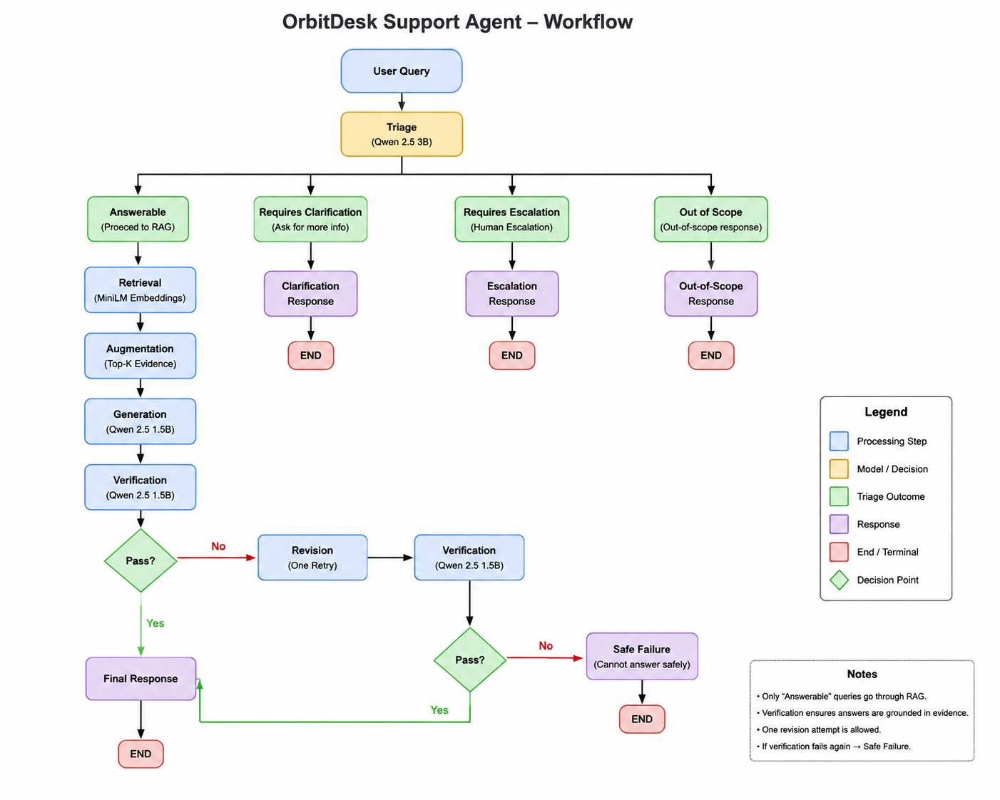

# OrbitDesk Support Agent

A local, AI-powered customer-support agent built for the **Tantrabodh AI
Engineer Internship Assignment**.

OrbitDesk Support Agent combines **Retrieval-Augmented Generation
(RAG)**, **four-way triage**, **LangGraph orchestration**, **response
verification**, **bounded retry/revision**, **safe failure**, and
**JSON-schema-validated structured output**.

The application runs its language models locally. No hosted LLM API
(OpenAI, Anthropic, Gemini, or otherwise) is used for runtime response
generation.

------------------------------------------------------------------------

## Overview

A support assistant should not blindly send every request through a
generation pipeline. OrbitDesk first **triages** an incoming request
into one of four routes:

-   `answerable`
-   `requires_clarification`
-   `requires_escalation`
-   `out_of_scope`

Only `answerable` requests enter the RAG pipeline. For those, relevant
evidence is retrieved from the supplied OrbitDesk knowledge base and
historical resolved cases, a local model generates an evidence-grounded
response, and that response is **verified** before being returned.

If verification fails, the graph allows **one revision attempt**. If the
revised response still fails verification, the system returns a **safe
failure** rather than presenting an unsupported answer.

------------------------------------------------------------------------

## 🎥 Project Walkthrough

[Watch the OrbitDesk Support Agent walkthrough](https://youtu.be/ktZeYnBQs-I)

A short demonstration covering the workflow graph, local model execution, routing, RAG, verification, safe-failure handling, and sample runs.

------------------------------------------------------------------------

## Architecture

``` text
                         User Query
                             |
                             v
                           Triage
                             |
        +--------------------+--------------------+
        |                    |                    |
        v                    v                    v
   Answerable       Requires Clarification   Requires Escalation
        |                    |                    |
        v                    v                    v
       RAG            Clarification          Escalation
        |               Response               Response
        v                    |                    |
    Retrieval                v                    v
        |                   END                  END
        v
   Augmentation
        |
        v
    Generation
        |
        v
     Verifier
        |
      +-+-+
      |   |
     PASS FAIL
      |   |
      v   v
     END Revision
           |
           v
        Verifier
           |
         +-+-+
         |   |
        PASS FAIL
         |   |
         v   v
        END Safe Failure
                |
                v
               END

Out-of-scope requests are routed directly to an out-of-scope response -> END.
```

The workflow is orchestrated with **LangGraph** using shared typed
state, deterministic routing functions, conditional edges, and bounded
retry behaviour.

A rendered graph diagram is included at `docs/graph.png`.

------------------------------------------------------------------------

## RAG Pipeline

``` text
Source Documents
      |
      v
   Chunking
      |
      v
MiniLM Embeddings
      |
      v
Document Vectors

User Query
      |
      v
Query Embedding
      |
      v
Cosine Similarity
      |
      v
Top-K Retrieval
      |
      v
Retrieved Evidence + Query
      |
      v
Local Qwen Generation
      |
      v
Generated Answer
```

The query and document chunks are embedded with the same Sentence
Transformer model. Cosine similarity ranks stored chunks by semantic
similarity to the query; the top-K chunks (default `k = 3`) are supplied
to the local generation model as evidence.

Current knowledge-base documentation is treated as **authoritative**.
Historical resolved cases are used as **supporting evidence only**.
Cases marked `superseded` are excluded deterministically at retrieval
time so outdated guidance cannot be surfaced as current instructions.

------------------------------------------------------------------------

## Triage

Triage runs **before** RAG and classifies every request into exactly one
of four routes.

  ---------------------------------------------------------------------
  Label                              Meaning
  ---------------------------------- ----------------------------------
  `answerable`                       The request contains enough
                                     information to follow a documented
                                     OrbitDesk support path. Proceeds
                                     to RAG.

  `requires_clarification`           Related to OrbitDesk, but missing
                                     information needed to safely
                                     determine the right path.

  `requires_escalation`              Documented troubleshooting has
                                     already been attempted and failed,
                                     or the situation matches a
                                     documented escalation condition.

  `out_of_scope`                     Unrelated to OrbitDesk support, or
                                     asks the assistant to do something
                                     outside its scope (for example
                                     refunds or legal advice).
  ---------------------------------------------------------------------

### Triage Model Selection

The initial triage implementation used `Qwen/Qwen2.5-1.5B-Instruct`.
During final testing, a larger `Qwen/Qwen2.5-3B-Instruct` model was
evaluated and produced more reliable routing on the assignment's
sample-style questions, particularly for distinguishing answerable,
escalation, and out-of-scope cases.

The final implementation therefore uses the **3B Qwen model for
triage**, while the 1.5B model remains responsible for answer generation
and verification.

The triage model output is validated deterministically against the four
allowed labels. An invalid or malformed model output falls back to
`requires_clarification`.

------------------------------------------------------------------------

## Verification

Generated answers are not automatically trusted. For the `answerable`
route, the response is checked against the retrieved evidence before
being returned.

**Deterministic checks:**

-   Retrieved evidence exists
-   Source identifiers are available
-   The generated answer is non-empty

**Model-based grounding check:** a local Qwen call evaluates whether the
response is supported by the retrieved evidence, avoids inventing
OrbitDesk behaviour or troubleshooting instructions, and does not
contradict the supplied evidence.

A response that passes proceeds to the final output. A response that
fails is routed to revision.

------------------------------------------------------------------------

## Retry and Safe Failure

``` text
Generation -> Verification -> PASS -> Final Response
                  |
                 FAIL
                  |
                  v
               Revision -> Verification -> PASS -> Final Response
                              |
                             FAIL
                              |
                              v
                         Safe Failure
```

Only **one revision attempt** is permitted. The shared state tracks
`retry_count`, and the LangGraph invocation also uses a recursion limit
as an additional safeguard against unbounded graph execution.

The revision node re-generates the answer using the verifier's failure
reason as additional guidance rather than repeating the identical
prompt.

Routes exercised during integration testing include:

``` text
triage -> rag -> verifier -> END
triage -> rag -> verifier -> revision -> verifier -> END
triage -> rag -> verifier -> revision -> verifier -> safe_failure -> END
```

------------------------------------------------------------------------

## Structured Output

Internal graph state is converted into the response contract defined in
`data/output_schema.json` via `src/output_formatter.py`, and validated
programmatically with `jsonschema` before being returned.

Required fields:

-   `classification`
-   `answer`
-   `sources`
-   `confidence`
-   `requires_human`
-   `reason`

Example:

``` json
{
  "classification": "answerable",
  "answer": "No, a Viewer cannot create an API credential in OrbitDesk. Viewers require an Admin or Owner role to access developer settings and create API credentials.",
  "sources": [
    {
      "source_id": "KB-005",
      "passage": "Only Owners and Admins can create or revoke credentials. Analysts and Viewers cannot create API credentials."
    }
  ],
  "confidence": 0.9,
  "requires_human": false,
  "reason": "The request was answerable using retrieved OrbitDesk evidence and the generated response passed verification."
}
```

`confidence` is an application-level indicator derived from
classification and verification outcome --- it is **not** a
statistically calibrated probability.

------------------------------------------------------------------------

## Models

  -------------------------------------------------------------------------------
  Role            Model                                      Purpose
  --------------- ------------------------------------------ --------------------
  Embedding       `sentence-transformers/all-MiniLM-L6-v2`   Document and query
                                                             embeddings, semantic
                                                             retrieval

  Triage          `Qwen/Qwen2.5-3B-Instruct`                 Four-way request
                                                             classification

  Generation      `Qwen/Qwen2.5-1.5B-Instruct`               Evidence-grounded
                                                             support-answer
                                                             generation

  Verification    `Qwen/Qwen2.5-1.5B-Instruct`               Evidence-grounding
                                                             verification
  -------------------------------------------------------------------------------

The Qwen 1.5B model is reused for generation and verification. Triage
uses the larger 3B Qwen model because routing accuracy was more
important than minimizing the already-bounded triage workload.

All models execute locally through Hugging Face libraries. No hosted
language-model API is required at runtime.

------------------------------------------------------------------------

## Model Details

### Exact Revisions

  ------------------------------------------------------------------------------------------------------
  Role           Model ID                                   Revision
  -------------- ------------------------------------------ --------------------------------------------
  Embedding      `sentence-transformers/all-MiniLM-L6-v2`   `1110a243fdf4706b3f48f1d95db1a4f5529b4d41`

  Triage         `Qwen/Qwen2.5-3B-Instruct`                 `aa8e72537993ba99e69dfaafa59ed015b17504d1`

  Generation /   `Qwen/Qwen2.5-1.5B-Instruct`               `989aa7980e4cf806f80c7fef2b1adb7bc71aa306`
  Verification                                              
  ------------------------------------------------------------------------------------------------------

Model revisions are recorded from the Hugging Face Hub so the exact
model versions used for development can be identified.

### Observed Load Time and Latency

Measurements below are representative local development measurements.
They depend on model cache state, hardware, and whether parameters are
offloaded.

  Component        Model       Observed task            Approx. latency
  ---------------- ----------- ------------------------ -----------------
  `triage.py`      Qwen 3B     Classification           \~3--14s
  `retrieval.py`   MiniLM      Query embedding          \~0.03s
  `rag.py`         Qwen 1.5B   Answer generation        \~50--150s
  `verifier.py`    Qwen 1.5B   Grounding verification   \~40--60s

The 3B triage model takes longer than the original 1.5B classifier, but
it improved the observed routing behaviour on the final test set. The
larger model is therefore used only where its additional cost provides
the most value.

Generation and verification remain the main latency bottlenecks because
the development GPU has only 4 GB VRAM and the Qwen models are partially
offloaded to CPU/system memory.

------------------------------------------------------------------------

## Technology Stack

-   Python
-   PyTorch
-   Hugging Face Transformers
-   Sentence Transformers
-   LangGraph
-   JSON Schema / `jsonschema`
-   Pytest
-   Qwen2.5 Instruct

------------------------------------------------------------------------

## Project Structure

``` text
orbitdesk-support-agent/
|
+-- data/
|   +-- output_schema.json
|   +-- resolved_cases.json
|   +-- sample_questions.json
|
+-- knowledge_base/
|   +-- 01_product_overview.md ... 10_security_and_safe_responses.md
|
+-- src/
|   +-- chunk_data.py
|   +-- load_data.py
|   +-- retrieval.py
|   +-- triage.py
|   +-- rag.py
|   +-- verifier.py
|   +-- output_formatter.py
|   +-- graph.py
|
+-- tests/
|   +-- test_graph_routing.py
|
+-- docs/
|   +-- graph.png
|
+-- .gitignore
+-- LICENSE
+-- README.md
+-- requirements.txt
```

------------------------------------------------------------------------

## Setup

### 1. Clone the repository

``` bash
git clone <repository-url>
cd orbitdesk-support-agent
```

### 2. Create a virtual environment

**Windows:**

``` powershell
python -m venv .venv
.\.venv\Scripts\Activate.ps1
```

If PowerShell blocks script execution for the current session:

``` powershell
Set-ExecutionPolicy -Scope Process -ExecutionPolicy Bypass
.\.venv\Scripts\Activate.ps1
```

**Linux/macOS:**

``` bash
python3 -m venv .venv
source .venv/bin/activate
```

### 3. Install dependencies

``` bash
pip install -r requirements.txt
```

Hugging Face models are downloaded automatically on first use. Initial
execution may take considerably longer depending on network speed and
hardware.

After the required models are downloaded, the application is designed to
run locally without a hosted LLM API.

------------------------------------------------------------------------

## Running the Agent

From the repository root:

``` bash
python src/graph.py
```

Node execution is logged to the terminal:

``` text
NODE: triage
NODE: rag
NODE: verifier
```

The script then prints the final state and the schema-validated
structured JSON output.

To change the input question, edit `initial_state["question"]` at the
bottom of `src/graph.py`.

------------------------------------------------------------------------

## Testing

Run the automated routing test:

``` bash
pytest tests/test_graph_routing.py -v
```

This verifies graph routing logic without depending on exact
model-generated wording.

The required integration cases are:

1.  A directly answerable question
2.  A question requiring information from two documents
3.  An ambiguous question requiring clarification
4.  An out-of-scope request
5.  A case where the initial generated answer fails verification

Integration testing also covers bounded retry behaviour and
structured-output JSON-schema validation.

------------------------------------------------------------------------

## Sample Outputs

Captured outputs from real local application runs are provided in
`sample_outputs.md`.

The captured examples demonstrate:

1.  A directly answerable request
2.  A request requiring evidence from multiple documents
3.  An ambiguous request requiring clarification
4.  An out-of-scope request
5.  A verification failure followed by safe failure
6.  An escalation request

The sample-output file records the question, classification/type,
execution path where relevant, verification result/reason, retrieved
sources where applicable, and structured output. No fabricated model
outputs are used. \## Graph Diagram



------------------------------------------------------------------------

## Hardware Used

Developed and tested locally on a Windows laptop:

-   **CPU:** \[Add exact CPU model before final submission\]
-   **System RAM:** 16 GB DDR5
-   **GPU:** NVIDIA GeForce RTX 3050 Laptop GPU, 4 GB VRAM
-   **Storage:** 512 GB SSD
-   **OS:** Windows

Because the available GPU VRAM is limited, Transformers/Accelerate may
place or offload model parameters across GPU, CPU, and system memory.

This directly contributes to the relatively high generation and
verification latency observed during full graph execution.

------------------------------------------------------------------------

## Final Submission Checklist

The repository contains the implementation, setup instructions, tests,
sample-output guidance, model details, hardware information, and graph
documentation required for submission.

The remaining submission artifacts are provided through the assignment
form as required: - GitHub repository link - Graph diagram (PNG/JPG) -
4--7 minute walkthrough video - Exact model names and revisions -
Hardware used and requirements

## Known Limitations

This implementation is intentionally scoped to the assignment's 3--4
hour development limit.

-   **Generation and verification share a model.** Both use the same
    local Qwen 1.5B model, so verification is not fully independent of
    the generator.
-   **Independent model loading.** `triage.py`, `rag.py`, and
    `verifier.py` load their own model instances. This increases startup
    time and memory usage.
-   **Triage is still an LLM classifier.** The larger 3B Qwen model
    improved observed behaviour on the supplied test set, but
    classification is not guaranteed to generalize perfectly to every
    unseen phrasing.
-   **Confidence values are application-level indicators**, not
    statistically calibrated probabilities.
-   **Retrieval quality is bounded by the supplied knowledge base and
    the general-purpose embedding model.**
-   **CPU/system-memory offloading occurs during inference** because the
    development GPU has only 4 GB VRAM, which significantly increases
    generation and verification latency.

### With more time

I would:

1.  decouple verification from the generation model;
2.  share model instances where practical to reduce memory and startup
    overhead;
3.  improve triage with a dedicated lightweight classifier or calibrated
    classification layer;
4.  calibrate `confidence` using retrieval and verification signals
    rather than fixed application-level values;
5.  add more automated integration coverage around failure and revision
    paths.

------------------------------------------------------------------------

## AI Assistance Disclosure

AI coding assistants --- **ChatGPT and Claude** --- were used during
development for concept explanation, architecture discussion, debugging
assistance, code review, testing guidance, and documentation assistance.

All code was executed, tested, integrated, and reviewed locally by the
author. The OrbitDesk application itself does not depend on ChatGPT,
Claude, Gemini, or any other hosted LLM API for runtime response
generation.

------------------------------------------------------------------------

## Security

No API keys, credentials, authentication secrets, or customer data are
included in this repository.

The virtual environment, Python caches, and local temporary files are
excluded via `.gitignore`.

------------------------------------------------------------------------

## License

MIT License --- see `LICENSE`.

------------------------------------------------------------------------

## Author

**Priyansh Srivastava**\
B.Tech Computer Science and Engineering\
Pranveer Singh Institute of Technology, Kanpur
